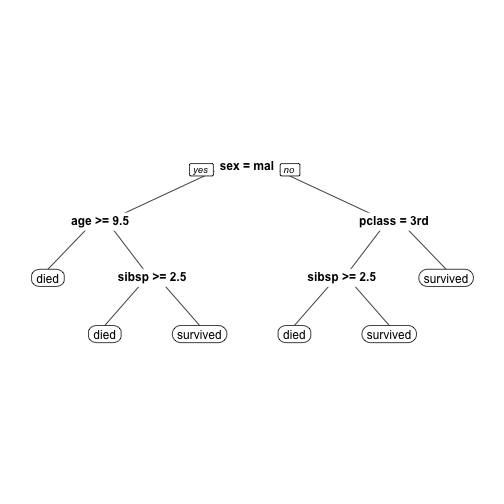

Shiny App Presentation
========================================================
author: MT
date: 28 Jan 2017
autosize: true

Titanic Data
========================================================
The Shiny app utilizes the titanic survival data. A sample is provided below.

```
  pclass survived    sex     age sibsp parch
1    1st survived female 29.0000     0     0
2    1st survived   male  0.9167     1     2
3    1st     died female  2.0000     1     2
4    1st     died   male 30.0000     1     2
5    1st     died female 25.0000     1     2
6    1st survived   male 48.0000     0     0
```


Form of the CART Model
========================================================
For this application we fit a basic CART model and allow the user to interactively update the maximum tree depth parameter (input$depth).

```r
rpart(survived~., method="class", data=ptitanic, maxdepth = 3)
```

Application Output
========================================================
We then plot the fitted tree for the input depth parameter.


Thank you!
========================================================
